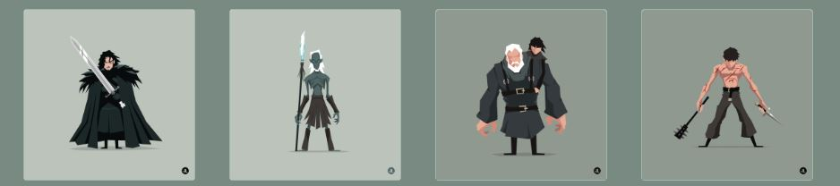

# Clicky-Thingy

This is a Web-Clicking game using React. The images are from the amazing illustrator [Jerry Liu](http://jerryliustudio.tumblr.com/).



## Table of Contents

- [Folder Structure](#folder-structure)
- [How does it work](#how-does-it-work)
- [Installation](#installation)
- [Deployment](#deployment)

## Folder Structure

This is the project structure:

```
Click-Thing/
  README.md
  click-thing/   
    node_modules/
    yarn.lock
    package.json
    public/
      favicon.ico
      index.html
      favicon.ico
    src/
      App.css
      App.js
      images.json
      index.css
      index.js
      components/
        Card/
          Card.css
          Card.js
          index.js
        Container/
          Container.css
          Container.js
          index.js
        Navbar/
          index.js
          Navbar.css
          Navbar.js
```

For the project to build, **these files must exist with exact filenames**:

- `public/index.html` is the page template;
- `src/index.js` is the JavaScript entry point.

You can delete or rename the other files.

## How does it work

This is a clicking game were the player click image card. each click the images will change place and the player will get a point. The player should click on each image only once. If the player should click on the same image card- the score will turn to zero.

This app uses React and all the cards are actually a single component multiplied by 12. The cards are implanted with images and randomly shuffled each time the user click.

## Installation

### Clone

- Clone this repo to your local machine. 

### Setup

> on your terminal go to the root and install the package first

```shell
$ yarn install
```
> then you can run the app on your localhost

```shell
$ yarn start
```

## Deployment

* [Heroku](https://afternoon-meadow-85631.herokuapp.com/)

## Authors

* **Eran Dromy** - [GitHub](https://github.com/erandro)